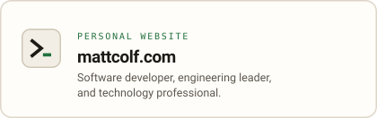
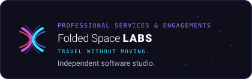

### Hi, I'm Matt :wave:

I'm a pragmatic software developer and engineering leader with 14+ years of industry experience, a strong technical background, and a history of driving successful solutions across e-commerce fulfillment and global supply chain, warehouse management, regulated online gaming, mortgage, payments, developer tooling, and higher education.

I've spent my career making software that people rely on, both as the developer writing it and as the leader responsible for the team, its technology strategy, and its roadmap. I'm happiest when I get to do both: working closely with product partners on where things should go, then staying near the code through system design, code review, and pairing. Before software I spent years in IT, running networks, data centers, and support, which still shapes how I think about infrastructure and the people who depend on it.

I have a strong interest in web services, security, software architecture, and keeping things simple and maintainable. I'm also a passionate advocate for DevOps culture, mentoring and growing junior engineers, standards compliance, leading with empathy, and doing the "right thing."

Right now I'm starting a new hands-on staff software engineering role — more on that soon — and building useful, well-crafted, privacy-preserving software through my own studio, [Folded Space Labs](https://foldedspacelabs.com). That's where my consulting work and my own products come together, including [Drey](https://heydrey.com), a calm, private-by-design package tracker, and [Metistry](https://github.com/foldedspacelabs/metistry), a personal AI operating system you own entirely.

I'm based in Detroit, Michigan, and I studied engineering at the University of Michigan. Away from the keyboard I'm an avid indie film enthusiast and keep a running log on [Letterboxd](https://letterboxd.com/mattcolf/).

  <a href="https://mattcolf.com/">
    <picture>
      <source media="(prefers-color-scheme: dark)" srcset="assets/card-website-dark.svg">
      
    </picture>
  </a>
  

Interested in getting in touch? Connect on [LinkedIn](http://www.linkedin.com/in/mattcolf), send me a note through the [contact form](https://mattcolf.com/contact) on my site, or [request a meeting](https://calendly.com/mattcolf).

## Find Me Around
- [LinkedIn](http://www.linkedin.com/in/mattcolf)
- [Personal Website](https://mattcolf.com/)
- [Folded Space Labs](https://foldedspacelabs.com/)
- [Letterboxd](https://letterboxd.com/mattcolf/)
- [Facebook](https://www.facebook.com/mattcolf) (no professional connections, please)
